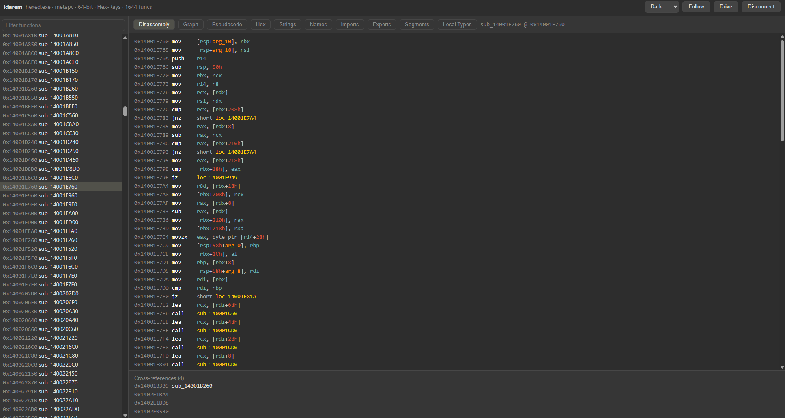
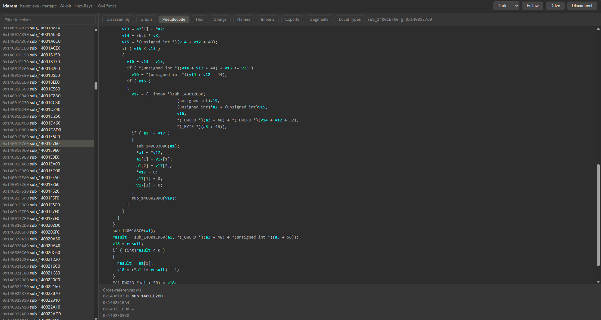

# idarem

> Review an IDA Pro database from anywhere in your browser. An IDA plugin serves the analysis (functions, disassembly, pseudocode, cross-references) over HTTP. React client renders it remotely — so the heavy lifting stays on the machine running IDA while you read it from a laptop, or your phone.


## Screenshots

| Disassembly | Pseudocode |
| --- | --- |
|  |  |

## Why

IDA runs on a workstation. When you're away from it, you usually can't review anything without RDP/VNC (heavy, laggy) or copying the database around. `idarem` exposes a thin HTTP API from inside the live IDA session, so a lightweight web client can browse the analysis over a tunnel from any device.

```
[ Workstation: IDA + Plugin ]  ──HTTP──▶  [ Tunnel ]  ──▶  [ Laptop: Browser ]
   Flask server in a thread                (Cloudflare /        React client
   + ida_kernwin.execute_sync               ngrok / Tailscale)
```

## How it works

- **`plugin/idarem.py`** — an IDA plugin that starts a Flask server in a daemon thread and answers REST queries.
- The IDA API is **not thread-safe**, so every database call is marshaled onto IDA's main thread with `ida_kernwin.execute_sync(...)`: `MFF_READ` for queries and `MFF_WRITE` for database changes.
- Endpoints: `/api/info`, `/api/functions`, `/api/disasm/<ea>`, `/api/graph/<ea>`, `/api/pseudocode/<ea>`, `/api/xrefs/<ea>`, `/api/hex`, `/api/strings`, `/api/names`, `/api/imports`, `/api/exports`, `/api/segments`, `/api/local-types`, `/api/events` (SSE).
- **Live follow** — a `UI_Hooks` watcher pushes IDA's current screen address *and active window* over Server-Sent Events; toggle **Follow IDA** in the client and the web jumps to the function you're on and switches to the matching tab (disassembly ↔ pseudocode ↔ strings ↔ hex …) as you move around IDA.
- **Drive IDA (web → IDA)** — toggle **Drive** and your clicks jump IDA's view (`jumpto`). Write-back can rename functions and local variables or add comments when explicitly enabled with `IDAREM_ALLOW_WRITE=1`; it is disabled by default.
- **`web/`** — a React + TypeScript (Vite) client: function list with filter, disassembly / graph / pseudocode tabs, a hex view, and the usual data windows (strings, names, imports, exports, segments, local types).
- **Responsive** — works on phones, tablets, and desktops: the function list collapses into a slide-over drawer on small screens, the graph pans and zooms by touch, and long lists are virtualized so even huge binaries stay light.

## Setup

### Quick install (Windows, recommended)

Builds the web client and registers the plugin so IDA loads it on every start.
First install the plugin dependency into the Python used by IDA (once):
`python -m pip install -r plugin/requirements.txt`. Then run the
installer — **double-click `scripts\install.bat`**, or from a terminal:

```powershell
powershell -ExecutionPolicy Bypass -File scripts\install.ps1
```

(The `.bat` and the `-ExecutionPolicy Bypass` flag both sidestep Windows' default
block on running `.ps1` files — the bypass is scoped to that one process and changes
nothing system-wide. Running the `.ps1` by double-click or directly will be blocked.)

It builds `web/dist`, then drops a tiny **loader** into `%APPDATA%\Hex-Rays\IDA Pro\plugins\`
that runs the plugin straight from this repo.

- You edit and `npm run build` **in place** — nothing to copy around, since the loader always points back at the repo (which auto-detects `web/dist` next to it).
- `Ctrl-Alt-R` starts or stops the server; open `http://localhost:8765`.

On first start, the plugin prints a cryptographically random session token in IDA's
Output window. Enter it on the connection page. To keep the same token across
restarts, set `IDAREM_AUTH_TOKEN` before launching IDA:

```powershell
[Environment]::SetEnvironmentVariable("IDAREM_AUTH_TOKEN", "paste-a-strong-token-here", "User")
```

Restart IDA after changing a user environment variable. Optional settings:

| Variable | Default | Purpose |
| --- | --- | --- |
| `IDAREM_HOST` | `127.0.0.1` | Bind address. Use `0.0.0.0` only for direct LAN/tailnet access. |
| `IDAREM_PORT` | `8765` | HTTP port. |
| `IDAREM_ALLOW_WRITE` | off | Set to `1` to allow rename/comment operations. |
| `IDAREM_CORS_ORIGINS` | local Vite origins | Extra comma-separated development client origins. |

The loader goes in IDA's per-user plugins folder (`$IDAUSR`, else
`%APPDATA%\Hex-Rays\IDA Pro\plugins`), which is the same **wherever IDA itself is
installed** — any folder or drive. Re-run `install.ps1` only if you move the repo;
`scripts\uninstall.ps1` removes the loader.

### Manual (any OS)

1. `python -m pip install -r plugin/requirements.txt` into IDA's Python.
2. Build the UI: `cd web && npm install && npm run build`.
3. Load `plugin/idarem.py` in IDA — run it from the repo (*File → Script file*) and it auto-detects `web/dist`; or copy it into a `plugins/` folder and set `WEB_ROOT` (or the `IDAREM_WEB_ROOT` env var) to the `web/dist` path.
4. `Ctrl-Alt-R` (or **Edit → Plugins → idarem**) starts the server on `http://localhost:8765`.

Open the address and you land on a **connection page** — enter the host/IP, port, and
the generated or configured token, then **Connect**. When the page is served by the plugin, the host field is
prefilled with the current address, so locally or over a tunnel you usually just add the token.

## Remote access

Reach the server from anywhere **without forwarding a raw port** (no TLS, IDA wide
open — don't). Pick by how you want to connect:

| You want… | Use | How |
| --- | --- | --- |
| Your own devices, from anywhere | **[Tailscale](https://tailscale.com/)** | Install on both machines, set `IDAREM_HOST=0.0.0.0`, then open `http://<workstation-tailnet-ip>:8765`. Nothing is published publicly. |
| A phone that already runs another VPN | **[Tailscale Funnel](docs/tailscale.md)** | Public HTTPS URL, no client needed on the phone. **Full step-by-step: [docs/tailscale.md](docs/tailscale.md).** |
| A public URL on your domain | **[Cloudflare Tunnel](https://developers.cloudflare.com/cloudflare-one/connections/connect-networks/)** (named) | `cloudflared tunnel --url http://localhost:8765`, or a named tunnel mapping `ida.yourdomain.com` → `localhost:8765`. HTTPS, no port-forward. |
| A throwaway public URL to test | **[ngrok](https://ngrok.com/)** | `ngrok http 8765` → open the `https://…` URL it prints. |

Because UI and API are on the same origin, opening the tunnel/public URL serves the
client and prefills the connection page with that URL — just add the token.

Every API session requires a token. If `IDAREM_AUTH_TOKEN` is absent, the plugin
generates a new strong token and prints it locally in IDA's Output window. The client
sends it only as `Authorization: Bearer <token>`; it is never placed in an SSE URL.
Keep write-back disabled unless you need it, and prefer a tunnel over forwarding the
raw HTTP port.

## Tech

IDAPython 3 (IDA 9.x) · Flask · Server-Sent Events · React · TypeScript · Vite

## Checks

```powershell
python -m unittest discover -s tests -v
cd web
npm test
npm run lint
npm run build
```

The backend tests use small IDA API stubs, so the authentication and input-validation
checks run without opening IDA. Runtime integration still needs IDA 9.x.

## License

MIT — see [LICENSE](LICENSE).
